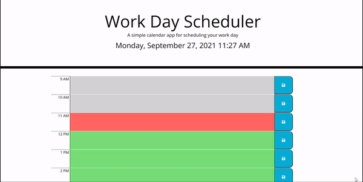

# Homework 5: Day Planner

## Objective 

Create a planner based on time blocking by hours of the work day that is also color coded. Include non-volatile memory via. ```localStorage```.

## Changes
There is a list of times and for each time there is a row generated (including time label, textarea, and save button). The save buttons have a click listener that saves the items in its associated textarea in ```localStorage```. Upon reload, the text areas are filled with ```localStorage``` data when the rows are being added. 

## Code

This is some prerequisite code used to highlight the main functionality of adding time blocks to our calendar:
```JavaScript
// List of time blocks used to enumerate blocks
const times = ["9-AM", "10-AM", "11-AM", "12-PM", "1-PM", "2-PM", "3-PM", "4-PM", "5-PM"];

// Get code from local storage
var savedTask = (id) => {
    var lsVal = localStorage.getItem("time-var-" + id); // local storage value
    return (lsVal == null) ? "" : lsVal;    // null when no value is recorded
};

var m = moment();       // Get time
var curHour = m.hour(); // Current hour

// Set color of text areas (time is a class on textarea)
var time = "past"; 

if (hourToMilitary(id) == curHour)
    time = "present";
else if (hourToMilitary(id) > curHour)
    time = "future";
```
This piece of code adds each time block to the dom (via. JQuery). This is looped for each of the listed ```times```. The ```id``` variable is used to represent each element in ```times```. 
```JavaScript
$(".container").append(`

    <div class="row">
    <h6 class="hour">${id.split('-').join(' ')}</h6> 
    <textarea name="" id="T${id}" class="${time}" cols="100" rows="3">${savedTask(id)}</textarea>
    <button class="saveBtn" id="B${id}"><i class="fa fa-save"></i></button>
    </div>
      
`);

```

Click listeners are then added again for each time block.

```JavaScript
// Create click listeners
$('button#B' + id).click((event) => {

    // Select associated value to save
    var btnID = event.currentTarget.id.substr(1); // ID of button (get rid of B at beginning)
    var saveText = $('textarea#T' + btnID).val(); // Text in text area

    localStorage.setItem('time-var-' + btnID, saveText);

    alert("Saved task for " + btnID.split('-').join(' ') + "!");

});

```

You may notice there are an extra 'B' and 'T' in front of some IDs. I had some bugs and I figured I would use code that is syntactically aligned with css. (you cannot use ```#9-AM``` very neatly with css but ```#B9-AM``` is ok). It also allows me to differentiate between the text areas and the buttons, whether this is necessary, I don't know. I just spent a few hours on a bug and now it works so I am happy with that.

## Screenshots

Calender



## Links

[Webpage](https://andrewtrudeau.github.io/05-day-planner/)

[Github](https://github.com/andrewtrudeau/05-day-planner)